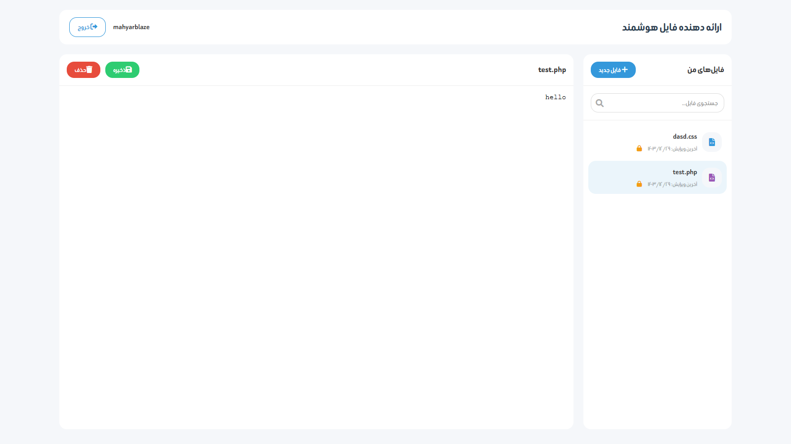
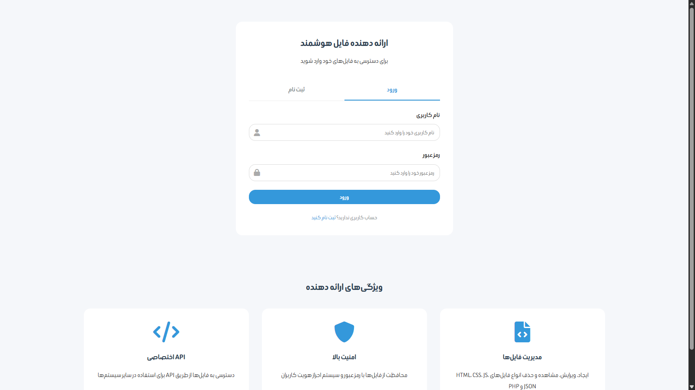

# 🚀 سرویس ارائه‌دهنده فایل

یک سرویس **ایمن و پرامکانات** برای مدیریت و ارائه فایل‌ها، ساخته شده با **PHP، HTML، CSS و JavaScript خالص**. این سیستم دارای **رابط کاربری فارسی**، قابلیت مدیریت فایل، محافظت با رمز عبور و API خارجی است.

---

## 📌 ویژگی‌ها

### 🔑 احراز هویت کاربران
- سیستم ورود و ثبت‌نام ایمن
- هش کردن رمزهای عبور با استفاده از `password_hash()`
- مدیریت نشست‌های کاربری

### 📂 مدیریت فایل‌ها
- ایجاد، خواندن، به‌روزرسانی و حذف فایل‌ها
- پشتیبانی از **HTML، CSS، JS، JSON و PHP**
- امکان حفاظت از فایل‌ها با رمز عبور
- قابلیت جستجو در فایل‌ها

### 🔗 API برای دسترسی خارجی
- ارائه API **RESTful** برای عملیات روی فایل‌ها
- احراز هویت مبتنی بر **توکن**
- مدیریت جامع خطاها

### 🔒 ویژگی‌های امنیتی
- هش کردن رمزهای عبور با استفاده از `password_hash()`
- جلوگیری از حملات **SQL Injection** با **Prepared Statements**
- اعتبارسنجی و پاک‌سازی ورودی‌ها
- محافظت در برابر حملات **CSRF**
- جلوگیری از حملات **XSS**
- مدیریت ایمن فایل‌ها با تعیین سطوح دسترسی مناسب

### 🎨 رابط کاربری
- **پشتیبانی از زبان فارسی** 🇮🇷
- طراحی **زیبا و واکنش‌گرا**
- نمایش آیکون و نشانگرهای مخصوص انواع فایل‌ها
- نمایش نشانگرهای امنیتی برای فایل‌های دارای رمز عبور

---

## 📥 نصب و راه‌اندازی

### 1️⃣ راه‌اندازی پایگاه داده
1. ایجاد یک پایگاه داده **MySQL**.
2. وارد کردن `db.sql` برای ایجاد جداول موردنیاز.
3. تنظیم اطلاعات اتصال به پایگاه داده در `includes/config.php`.

### 2️⃣ نیازمندی‌های سرور
- **PHP 7.4+**
- **MySQL 5.7+**
- **Apache/Nginx**
- فعال‌سازی `mod_rewrite` برای مسیریابی API

### 3️⃣ تنظیم مجوزهای فایل
- اطمینان از اینکه دایرکتوری `files/` **قابل نوشتن** باشد.
- مجوزهای پیشنهادی:
  - **755** برای پوشه‌ها
  - **644** برای فایل‌ها

### 4️⃣ پیکربندی
- تنظیمات را در `includes/config.php` انجام دهید.
- مسیرهای فایل و تنظیمات امنیتی را تنظیم کنید.

---

## 📡 مستندات API
این سیستم شامل **API RESTful** برای دسترسی خارجی به عملیات مدیریت فایل است.

### 🔐 احراز هویت
تمامی درخواست‌های API **به‌جز ورود و ثبت‌نام** نیاز به احراز هویت دارند. احراز هویت از طریق **توکن Bearer** در هدر `Authorization` انجام می‌شود.

### 📌 نقاط انتهایی API
| متد       | مسیر API                | توضیحات                          |
|-----------|-------------------------|----------------------------------|
| `POST`    | `/api/auth`             | ورود یا ثبت‌نام کاربران         |
| `GET`     | `/api/files`            | دریافت لیست فایل‌ها             |
| `GET`     | `/api/files/{id}`       | دریافت جزئیات یک فایل           |
| `POST`    | `/api/files`            | ایجاد فایل جدید                 |
| `PUT`     | `/api/files/{id}`       | ویرایش فایل                     |
| `DELETE`  | `/api/files/{id}`       | حذف فایل                        |

---

## 📸 تصاویر پنل

### 🔹 صفحه ورود

### 🔹 داشبورد

### 🔹 مدیریت فایل‌ها

---

💡 **توسعه‌یافته با ❤️ توسط DevZeus (Mahyar Asghari) با استفاده از PHP، HTML، CSS و JavaScript**